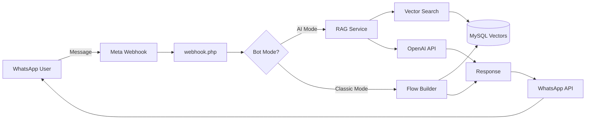

## What is WhatsApp RAG Bot?

WhatsApp RAG Bot is a powerful, self-hosted customer service automation platform that combines the convenience of WhatsApp messaging with advanced AI capabilities. Built with PHP and MySQL, it uses Retrieval-Augmented Generation (RAG) to provide intelligent, context-aware responses to customer inquiries.

## Key Features

<CardGroup cols={2}>
  <Card title="RAG-Powered Responses" icon="brain">
    Upload your documents (PDF, DOCX, TXT) and let the bot provide accurate answers based on your knowledge base using OpenAI embeddings and vector search.
  </Card>
  
  <Card title="Dual Bot Modes" icon="toggle-on">
    Switch between **AI Mode** for intelligent responses and **Classic Mode** for rule-based conversation flows with predefined decision trees.
  </Card>
  
  <Card title="Audio Transcription" icon="microphone">
    Automatically transcribe WhatsApp audio messages using OpenAI Whisper API, converting voice notes into text for processing.
  </Card>
  
  <Card title="Google Calendar Integration" icon="calendar">
    Built-in appointment scheduling with automatic calendar management, business hours validation, and multi-step booking flows.
  </Card>
  
  <Card title="Conversation Management" icon="comments">
    Track all conversations with message history, AI confidence scores, human handoff capability, and real-time dashboard monitoring.
  </Card>
  
  <Card title="Self-Hosted & Secure" icon="shield">
    Complete control over your data. Encrypted credentials, signature validation, and runs on your infrastructure (cPanel/SiteGround compatible).
  </Card>
</CardGroup>

## Architecture Overview

The WhatsApp RAG Bot uses a modern architecture designed for scalability and intelligence:



### Core Components

<Steps>
  <Step title="Webhook Handler">
    The `webhook.php` file receives incoming messages from Meta's WhatsApp Business API, validates signatures, and routes messages to the appropriate processing logic.
  </Step>
  
  <Step title="RAG Pipeline">
    Documents are chunked, embedded using OpenAI's text-embedding-ada-002 model, and stored as vectors in MySQL. Queries are matched using cosine similarity for context retrieval.
  </Step>
  
  <Step title="Conversation Service">
    Manages conversation state, message history, AI enable/disable status, and human handoff workflows with full audit trails.
  </Step>
  
  <Step title="WhatsApp Service">
    Handles all Meta Graph API interactions: sending messages, downloading media, marking messages as read, and webhook verification.
  </Step>
</Steps>

## Technology Stack

<CodeGroup>

```json composer.json
{
  "require": {
    "php": "^7.4 || ^8.0",
    "guzzlehttp/guzzle": "^7.0",
    "phpoffice/phpword": "^0.18",
    "smalot/pdfparser": "^0.18"
  }
}
```

```php Backend Services
// Core Services
App\Services\WhatsAppService    // WhatsApp API integration
App\Services\OpenAIService      // GPT & Embeddings
App\Services\RAGService          // Retrieval-Augmented Generation
App\Services\VectorSearchService // Cosine similarity search
App\Services\ConversationService // State management
App\Services\DocumentService     // File processing
```

</CodeGroup>

### Database

- **MySQL 5.7+** with utf8mb4 support
- Vector embeddings stored as BLOB fields
- Optimized indexes for similarity search
- Full-text search capabilities

### AI Models

- **GPT-3.5-turbo** or **GPT-4** for response generation
- **text-embedding-ada-002** for document vectorization (1536 dimensions)
- **Whisper API** for audio transcription

## Use Cases

<AccordionGroup>
  <Accordion title="Customer Support Automation">
    Automatically answer frequently asked questions, provide product information, and escalate complex issues to human agents when needed.
  </Accordion>
  
  <Accordion title="Appointment Scheduling">
    Allow customers to book, reschedule, or cancel appointments directly through WhatsApp with automatic Google Calendar synchronization.
  </Accordion>
  
  <Accordion title="Knowledge Base Assistant">
    Upload your product manuals, policies, or documentation and let customers query information conversationally.
  </Accordion>
  
  <Accordion title="Lead Qualification">
    Use the flow builder to create interactive conversation trees that qualify leads and route them appropriately.
  </Accordion>
</AccordionGroup>

## System Requirements

<Note>
Before installation, ensure your server meets these minimum requirements:
</Note>

- **PHP**: 7.4 or higher (8.0+ recommended)
- **MySQL**: 5.7+ or MariaDB 10.2+
- **Memory**: 512MB minimum (1GB recommended)
- **Extensions**: curl, json, mbstring, mysqli, zip, xml
- **Web Server**: Apache with mod_rewrite or Nginx
- **SSL Certificate**: Required for WhatsApp webhook

## Getting Help

If you encounter issues or have questions:

- Check the [Installation Guide](/installation) for setup troubleshooting
- Review the [Configuration](/configuration) section for credential setup
- Explore the [API Reference](/api-reference) for integration details
- See [Common Issues](/troubleshooting) for debugging tips

## Next Steps

Ready to get started? Follow our [Quickstart Guide](/quickstart) to get your bot running in minutes, or dive into the complete [Installation Guide](/installation) for a production-ready setup.

<CardGroup cols={2}>
  <Card title="Quickstart" icon="rocket" href="/quickstart">
    Get up and running with a basic setup in 10 minutes
  </Card>
  
  <Card title="Installation" icon="download" href="/installation">
    Complete production installation guide with all configuration options
  </Card>
</CardGroup>